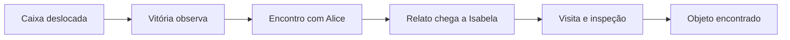

# Melhorias e novas visões para o Contracenador

Pesquisa e revisão: 27/09/2026, após as primeiras correções de conhecimento e confissão.

Este documento complementa o [roadmap do motor de mundo](Roadmap_Motor_de_Mundo.md). Reúne achados do código, referências primárias e propostas de experimentos. As propostas são recomendações para o projeto, não resultados já demonstrados nele. Esta rodada não implementa novos comportamentos.

## 1. Direção recomendada

O diferencial mais promissor é **fazer uma informação mudar o que um personagem consegue e decide fazer**. Uma pista gera uma pergunta; a resposta motiva uma visita; a visita provoca um encontro; o encontro muda uma relação ou objetivo.

Locais, armas, celulares e esconderijos são parte desse sistema. Para que a história pareça viva, os atores também precisam de atividades próprias, lacunas de conhecimento, compromissos e razões para cooperar ou esconder algo.

Proponho três prioridades:

1. Fechar os caminhos restantes entre fala, conhecimento e efeitos sociais.
2. Demonstrar uma cadeia completa de descoberta, encontro, transmissão e ação em um mapa pequeno.
3. Reutilizar esse núcleo em uma história cooperativa para descobrir quais regras ainda estão presas ao gênero de investigação.

## 2. O que as referências acrescentam

| Referência primária | Ideia sustentada pela fonte | Aplicação proposta ao Contracenador |
|---|---|---|
| [Generative Agents — Park et al., 2023](https://arxiv.org/abs/2304.03442) | Arquitetura com memória de experiências, recuperação, reflexão e planejamento; o trabalho avalia a contribuição desses componentes. | Adicionar planos curtos e reflexões ocasionais que conservem as fontes das informações. Medir o ganho antes de aumentar o contexto ou as chamadas ao modelo. |
| [Concordia — Google DeepMind, 2023](https://deepmind.google/research/publications/64717/) | Separa os agentes de um Game Master que interpreta ações e simula seus efeitos no ambiente. | Manter intenção separada de execução. Neste projeto, recomendo que regras de movimento, posse e percepção sejam verificadas em Python; essa escolha é uma adaptação, não uma exigência do artigo. |
| [Versu — Evans e Short, 2014](https://cs.uky.edu/~sgware/reading/papers/evans2014versu.pdf) | Práticas sociais oferecem ações possíveis segundo a situação e os papéis; os agentes continuam decidindo como agir. | Conversas podem ter formas específicas: pedir ajuda, negociar, confrontar, prometer e recusar. Cada forma oferece ações e condições de encerramento próprias. |
| [Prom Week — descrição dos autores, 2012](https://promweek.soe.ucsc.edu/2012/02/22/prom-weeks-social-exchanges/) | Uma troca social tem intenção, resposta do outro e efeitos sobre relações; a fala expressa essa interação. | Modelar o que uma fala tenta realizar e se o interlocutor aceita. Uma promessa ou pedido não deve produzir sucesso só porque apareceu no texto. |
| [TinyTroupe — repositório da Microsoft](https://github.com/microsoft/TinyTroupe) | Documenta checkpoints, cache de chamadas, verificações de qualidade e acompanhamento de custos. | Criar reprodução de cenas, comparação de configurações e orçamento de inferência. São referências de instrumentação; não há necessidade demonstrada de trocar o motor atual por esse framework. |

Os trabalhos não demonstram que os mesmos resultados aparecerão nos modelos locais e nas regras deste projeto. Servem para formular hipóteses e testes. A seleção combina trabalhos de narrativa anteriores aos LLMs com sistemas de agentes generativos, porque parte do problema está nas regras sociais e no desenho da experiência.

## 3. Achados novos após as correções

As correções recentes resolveram a consulta indiscriminada de evidências por origem e o sorteio recorrente de confissão protegida. A revisão encontrou outros caminhos que merecem prioridade.

### 3.1 Informação sensível pode entrar na fala pelo reconhecimento

Em [`Actor.knows_about` e `respond`](../contracenador/agents/agent.py), memórias compartilháveis sobre o interlocutor entram diretamente no prompt de reconhecimento. Esse caminho não passa por `choose_action` para cada informação.

Reprodução isolada: uma testemunha com memória de sensibilidade máxima sobre Tiago recebe uma pergunta dele. O conteúdo chega ao prompt e pode ser verbalizado, enquanto o envelope permanece com `facts=[]`. Isso produz dois problemas: o segredo pode sair sem autorização da política e o destinatário não registra formalmente o que foi dito.

**Melhoria:** distinguir reconhecer a pessoa de escolher o que dizer sobre ela. Toda informação factual que entrar na fala deve passar pela mesma autorização e receber uma referência no envelope. O contexto privado de planejamento deve ficar separado do contexto usado para verbalizar.

**Teste de aceitação:** quando a política escolhe esconder, o texto sensível não aparece no prompt do gerador da fala; quando escolhe revelar, o destinatário recebe a mesma proposição autorizada.

### 3.2 Uma acusação pode ter efeito sem ter sido dita

Em [`Actor.respond`](../contracenador/agents/agent.py), a checagem de verbalização percorre `outgoing_facts`. As acusações produzidas por `DEFLECT` seguem outro caminho.

Reprodução isolada: forçar `DEFLECT` e usar uma resposta simulada “Bom dia.” ainda produz uma acusação no envelope; quem recebe forma uma crença com confiança 0,65 contra o acusado.

**Melhoria:** confirmar todos os atos de fala com efeitos no estado, incluindo acusação e ameaça. Se a geração falhar, reparar ou descartar o ato antes de aplicar seus efeitos. Uma intenção interna não é um acontecimento público.

**Teste de aceitação:** uma fala neutra não cria suspeita nem medo, mesmo que a intenção preliminar fosse acusar ou ameaçar.

### 3.3 A confissão precisa de calibração e de confronto com evidência

Em [`choose_action`](../contracenador/agents/actions.py), a nova regra protege o segredo por custo de exposição. Para os traços do Tiago da transcrição, porém, a margem máxima é negativa mesmo com confiança, culpa, medo e favor no máximo e desconfiança zero:

```text
benefício máximo = 2 + 1,5×0,8 + 1 + 3×(1−0,9) + 0,8 − 2,5×0,9 = 3,05
custo = 4×0,9×0,9 + 1 = 4,24
margem = −1,19
```

Com esses traços, sensibilidade e objetivo ativo inalterados, esse personagem não pode confessar pela regra atual. Isso pode ser uma escolha válida para um personagem obstinado, mas deve ser explícito no cenário. A função também não considera diretamente quais evidências foram apresentadas ao personagem.

**Melhoria:** introduzir uma ação de confronto que mostre evidências conhecidas ao suspeito e atualize sua percepção de exposição. Comparar custos de sustentar o álibi, admitir parcialmente, recusar e confessar. Usar somente o que ele percebeu; o culpado não deve consultar o conhecimento privado do investigador.

**Teste de aceitação:** repetir uma pergunta não altera a decisão; apresentar uma nova evidência relevante pode alterá-la. Perfis obstinados continuam podendo recusar, sem obrigar toda investigação a terminar em confissão.

### 3.4 A procedência precisa sobreviver aos repasses

O [`source_id` da memória](../contracenador/agents/agent.py) identifica registros locais, e a deduplicação dos [testemunhos](../contracenador/cli/main.py) considera o informante imediato. Um relato que circula por pessoas diferentes ainda pode parecer uma confirmação independente.

**Melhoria:** separar `observation_id`, `claim_id`, informante imediato e fonte original. Guardar um caminho de transmissão. Se três atores repetem a mesma observação, há três transmissores, mas uma única origem de evidência.

**Teste de aceitação:** A → B → C → investigador não multiplica a força da observação de A. Duas observações independentes podem corroborar uma hipótese mesmo se forem descritas com palavras parecidas.

### 3.5 Tempo do mundo deve ser independente do desempenho do computador

As [emoções](../contracenador/agents/emotions.py) decaem com `time.time()`. Logo, uma inferência mais lenta ou uma pausa do operador pode mudar o estado emocional antes da próxima decisão.

**Melhoria:** usar um relógio de simulação para emoções, deslocamentos e compromissos. Reservar tempo real para métricas de desempenho. Persistir o relógio junto do estado.

**Teste de aceitação:** introduzir atraso artificial no LLM não muda o estado final quando intenções aceitas e ticks são os mesmos. Para reprodução exata da fala, registrar as respostas; uma seed sozinha não basta.

## 4. Dar aos personagens material que produza ação

Biografias maiores não garantem diálogos melhores. Cada ator deve receber um pacote pequeno e utilizável:

| Elemento | Exemplo para Vitória |
|---|---|
| Observação situada | Viu uma caixa deslocada no depósito depois da virada. |
| Conhecimento prático | Sabe onde guardar as decorações e quem costuma usar a chave. |
| Objetivo imediato | Guardar os materiais antes de ir embora. |
| Lacuna | Não sabe quem abriu o depósito nem o que foi colocado na caixa. |
| Relação útil | Alice organiza o espaço e pode explicar a mudança. |
| Limite pessoal | Evita acusar alguém sem ter certeza. |

Esse conjunto dá motivo para caminhar, procurar Alice, formular uma pergunta e decidir quanto contar. O mesmo personagem também pode conversar sobre assuntos pessoais, mas eles não devem ocupar todo o espaço disponível no contexto.

Duas capacidades adicionais merecem experimentos:

- **Planos curtos:** escolher até três passos, com condições de interrupção. Exemplo: buscar a chave → ir ao depósito → guardar as caixas. Replanejar se faltar a chave ou surgir uma observação relevante.
- **Reflexões com referências:** depois de uma contradição ou ao fim de uma conversa, registrar uma hipótese curta com os IDs que a motivaram. Reflexão não pode criar uma observação nova nem transformar suspeita em verdade.

O uso combinado de memória, reflexão e planejamento tem precedente em [Generative Agents](https://arxiv.org/abs/2304.03442); o tamanho dos planos e os gatilhos acima são propostas a testar aqui.

## 5. Novas visões de produto

| Visão | Experiência | Primeiro experimento | Condição para expandir |
|---|---|---|---|
| **Investigação em um ambiente ativo** | A festa continua enquanto o caso é apurado: atores guardam objetos, saem, conversam e mudam o que pode ser observado. | Um celular, três locais e um encontro que transmite a pista. | Posição e informação realmente mudam as ações seguintes. |
| **Drama de cooperação e desencontros** | Cinco pessoas tentam organizar uma festa; uma informação antiga sobre horário ou local atrapalha a coordenação. | Mesmos locais e objetos, objetivo comum e distribuição desigual de informação. | Funciona sem inventar culpado ou forçar interrogatórios. |
| **Negociação e compromissos** | Pessoas trocam ajuda, acesso a objetos e promessas; cumprir ou quebrar um acordo altera relações. | Uma chave, um favor e uma promessa com prazo e aceitação explícita. | O efeito social depende do cumprimento observado, não só do texto da promessa. |
| **Laboratório de dramaturgia “e se?”** | O usuário compara a mesma cena depois de mudar um encontro, uma relação ou uma porta aberta. | Salvar um checkpoint e gerar duas ramificações com uma única alteração. | É possível explicar quais acontecimentos mudaram e por quê. |

Minha prioridade de produto seria consolidar a investigação, testar cooperação e então escolher entre jogo social e ferramenta para autores. Não desenvolver os quatro modos simultaneamente.

Hoje o [schema](../contracenador/scenarios/validator.py) e o [prompt do roteirista](../contracenador/llm/prompts.py) exigem os papéis de culpado, investigador e testemunha. Para validar outras histórias, separar o núcleo do mundo das regras do gênero. O scheduler já aceita uma política externa; esse é um ponto de extensão existente.

Um motor genérico teria atores, locais, objetos, observações, compromissos e objetivos. A investigação acrescentaria suspeitos, álibis e condições de acusação. A cooperação acrescentaria tarefas compartilhadas e condições de entrega. A separação entre personagem e papel narrativo também aparece em [Versu](https://cs.uky.edu/~sgware/reading/papers/evans2014versu.pdf).

## 6. Próximo marco: uma descoberta muda o encontro seguinte

Antes de implementar todas as capacidades do roadmap, fazer uma demonstração completa com **5 atores, 3 locais, 1 celular escondido, 1 recipiente e até 20 ticks**. O roadmap continua mirando cinco locais; três bastam para verificar o primeiro ciclo.

1. Carregar cenário fixo escrito à mão, com o objeto já escondido.
2. Vitória vai ao depósito por um objetivo próprio e percebe a caixa deslocada.
3. Só Vitória recebe essa observação.
4. Ao encontrar Alice no corredor, pode contar o que percebeu.
5. Alice pode procurar Isabela e repassar a informação, conservando a fonte.
6. Isabela ganha um motivo conhecido para visitar e inspecionar o depósito.
7. Encontrar o celular conclui a busca do objeto; atribuir autoria continua sendo outro problema.



O teste mais importante é executar uma variante em que o encontro Vitória–Alice não acontece. Na fixture, sem outra rota de transmissão e sem política de busca indiscriminada, Isabela não deve receber aquela pista nem iniciar a busca por causa dela. O cenário pode terminar inconclusivo. Isso verifica a importância causal do encontro.

Para essa entrega, bastam movimento com validação, percepção, inspeção, transmissão e uma política simples de objetivos. Esconder dinamicamente objetos, gerar mapas com LLM e simular passagem de pessoas pelo meio de corredores podem vir depois.

## 7. Tornar o comportamento compreensível

Uma interface de inspeção pode ser mais valiosa neste momento do que um cenário 3D. Proponho quatro vistas, inicialmente no terminal ou em um relatório:

- **Mapa:** posições, conexões e atividades atuais.
- **Visão do personagem:** o que ele observou, ouviu e acredita, sem solução global.
- **Linha do tempo:** ações aceitas, acontecimentos e destinatários das observações.
- **Causa da decisão:** regras usadas, fatos autorizados e motivo de rejeição de uma ação. Registrar dados de execução, sem depender de pedir ao modelo uma justificativa retrospectiva.

Isso também permite dois modos futuros: observar o elenco autonomamente ou assumir um papel com o mesmo acesso limitado ao conhecimento. A visão onisciente fica como ferramenta de autoria e depuração.

## 8. Experimentos que orientam as próximas decisões

| Comparação | Manter igual | Medir | Decisão |
|---|---|---|---|
| Uma memória inicial × pacote de contexto acionável | Caso, elenco, modelo e limite de inferência | Perguntas específicas, repetição, fatos inventados e ações motivadas | Se enriquecer o roteiro melhora o comportamento ou apenas aumenta tokens. |
| Pareamento por rodada × encontros por localização | Objetivos, mapa e orçamento de chamadas | Conversas dependentes de movimento e mudanças posteriores de ação | Se o mapa faz parte do motor ou apenas da descrição. |
| Sem reflexão × reflexão por acontecimento relevante | Mesmas observações disponíveis | Coerência de hipóteses, custo e criação indevida de fatos | Se a reflexão merece entrar no ciclo. |
| Investigação × cooperação | Mesmo núcleo de movimento, objetos e percepção | Regras específicas que precisam ser alteradas | Onde separar gênero e mundo. |
| Cena original × uma intervenção | Checkpoint, políticas e entradas anteriores | Eventos que mudam e relações causais preservadas | Se o sistema pode oferecer exploração de versões para autores. |

Primeiro verificar invariantes sem LLM. Depois avaliar pequenas amostras com o modelo real e julgamento humano de fidelidade, resposta à pergunta e voz do personagem. Melhorar a taxa de vitória do investigador, isoladamente, não mede qualidade narrativa.

## 9. Ordem prática recomendada

1. Corrigir reconhecimento e atos de fala sem efeito verbal; acrescentar regressões para negação e acusação descartada.
2. Preservar fonte original dos relatos e distinguir corroboração de repetição.
3. Introduzir relógio simulado e experimentar confronto por evidência, sem voltar a sorteios por insistência.
4. Entregar a cadeia completa em três locais, incluindo a variante que remove o encontro.
5. Melhorar o roteirista com conteúdo que motive ações e lacunas que gerem perguntas.
6. Rodar uma fixture cooperativa e escolher a próxima direção de produto a partir do resultado.

Evitar agora uma troca de framework, modelo maior por padrão ou escala de dezenas de atores. Essas mudanças só devem ganhar prioridade se medições mostrarem um limite que o desenho atual não resolve.

## 10. Escopo e evidências desta revisão

- Leitura do código atual e da documentação local, incluindo as mudanças ainda não commitadas.
- Pesquisa nas fontes primárias citadas, consultadas em 27/09/2026.
- Reproduções pontuais de reconhecimento, acusação e limite de confissão em ambiente isolado, com SQLite em memória e respostas simuladas.
- Nenhuma nova execução com llama-server, alteração dos saves ou medição da naturalidade com o modelo real nesta rodada.
- As recomendações de produto e os critérios dos experimentos são propostas de engenharia e narrativa; não foram validados por usuários.
