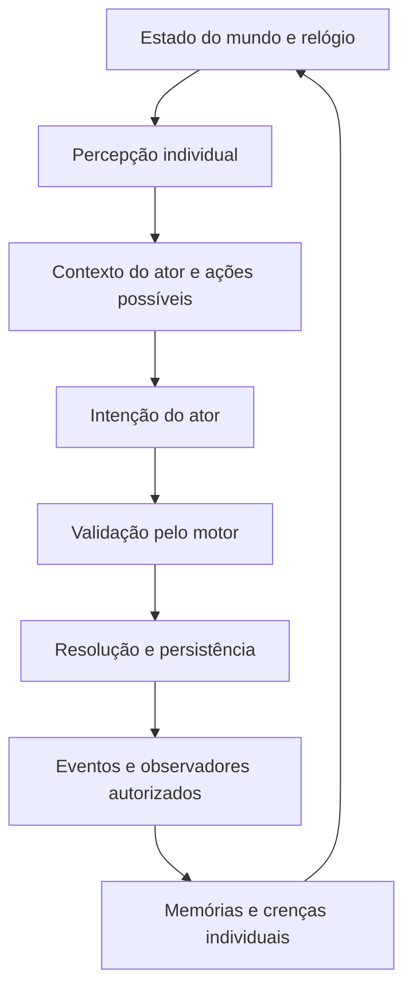

# Roadmap de evolução — motor de mundo e roteirista

Data: 27/09/2026. Base: código atual e transcrição `TesteAtores.txt` fornecida pelo usuário.

Este documento define a próxima sequência de implementação. O [roadmap anterior](Contracenador_Roadmap.md) continua como visão de longo prazo; aqui as prioridades partem do que já funciona e dos problemas observados. O diagnóstico abaixo registra o estado anterior às correções; o progresso está indicado a seguir.

### Progresso da Fase 0 — conhecimento e confissão

- [x] Restringir atualização de crenças aos IDs de relatos entregues ao investigador e validar o destinatário.
- [x] Separar objetivos e contexto dos fatos compartilháveis, com migração do formato legado.
- [x] Classificar testemunhos como apoio, refutação ou informação neutra; deduplicar reforço por origem e conteúdo.
- [x] Vincular o segredo ao objetivo e substituir o sorteio de confissão protegida por avaliação de custo.
- [x] Impedir que repetir a mesma mentira acumule culpa, ou o mesmo fato acumule confiança/favor.
- [x] Remover o uso da verdade oculta como tópico da ferramenta de simulação em lote.
- [ ] Encerrar automaticamente conversas improdutivas e acompanhar perguntas respondidas.
- [ ] Calibrar os pesos e avaliar a qualidade verbal com o modelo local real.

O rastreamento de uma fonte original através de vários informantes e a classificação de contradições semânticas continuam nas fases seguintes. As crenças já contaminadas de saves antigos não são recalculadas automaticamente.

## 1. Direção recomendada

O próximo marco deve ser uma investigação pequena em um mundo consistente: **5 atores, 5 locais conectados, objetos persistentes, pistas descobertas por ações e conversas que transferem conhecimento entre pessoas presentes**.

A ideia de adicionar locais, uma arma escondida e vestígios é adequada porque dá aos personagens coisas concretas para fazer, perceber e discutir. No cenário de roubo, o objeto central será o celular; em outro cenário, poderá ser uma arma. O motor deve representar ambos sem depender do tipo de crime.

O principal investimento deve ser no estado e nas regras. Ampliar o prompt ou trocar o modelo, isoladamente, não resolve a falta de informação, a confissão aleatória ou a ausência de consequências físicas.

Responsabilidades propostas:

| Parte | Responsabilidade |
|---|---|
| Roteirista | Criar o caso, a cronologia anterior ao início, as motivações e o conhecimento inicial de cada pessoa. |
| Cenógrafo | Definir mapa, conexões, objetos e esconderijos; inicialmente uma etapa do mesmo gerador. |
| Motor de mundo | Validar ações, avançar tempo, alterar posições e objetos e registrar acontecimentos. Código Python. |
| Percepção | Converter acontecimentos em observações individuais, conforme presença, visibilidade e audiência. |
| Ator | Escolher intenções a partir do que sabe e expressar a ação ou fala autorizada. |
| Coordenador de cenas | Organizar encontros, turnos de conversa, interrupções e encerramento. |
| Diretor narrativo | Futuramente, ajustar ritmo com eventos possíveis. Não reescrever a verdade do caso. |

Não é necessário criar um servidor LLM para cada papel. Manter a separação atual entre geração do cenário e interpretação dos atores, com coordenação determinística no meio.

## 2. Diagnóstico do resultado atual

Na transcrição, Isabela interroga Tiago cinco vezes no primeiro bloco. Ele esconde a mesma memória nas quatro primeiras respostas e confessa na quinta. As perguntas continuam genéricas, os dois passam a perguntar um ao outro quem roubou o celular e Isabela afirma já ter conversado com convidados sem isso ter ocorrido no trecho apresentado.

O resultado indica pouco conteúdo disponível e instruções de conversa pouco específicas. Não permite concluir, por uma única execução, qual seria a taxa de sucesso ou repetição do sistema.

### O que já merece ser preservado

- SQLite por ator e banco separado para o mundo.
- Eventos e evidências associados a acontecimentos.
- Memórias, versões falsas, crenças, emoções, relações e objetivos persistentes.
- Envelopes de conversa e isolamento entre pares; influência privada do culpado já existe.
- Recuperação lexical e por embeddings, com fallback.
- Scheduler separado da política e prevenção de um ator participar de duas conversas simultâneas.
- Configuração de experimentos, controle de modelos locais e testes sem inferência real.

Portanto, não começar recriando `WorldState`, `Beliefs` ou o scheduler. Evoluir os componentes existentes.

### Problemas e pontos de melhoria

| Prioridade | Evidência no código | Efeito e melhoria |
|---|---|---|
| P0 | [`actions.py`, `choose_action`](../contracenador/agents/actions.py): a decisão `REVEAL` ocorre antes da análise do objetivo; `deceit` não reduz diretamente essa probabilidade. | O objetivo de não ser descoberto não protege a informação incriminadora. Modelar custo de exposição e condições para confessar. |
| P0 | [`loader.py`, `materialize_scene`](../contracenador/scenarios/loader.py): o objetivo do investigador também vira memória compartilhável. | Isabela pode esconder ou revelar o próprio objetivo como se fosse pista. Separar objetivo, conhecimento público e segredo. |
| P0 | [`main.py`, `_update_beliefs_from_evidence`](../contracenador/cli/main.py): consulta todas as evidências por origem quando chega algum fato ou acusação dessa pessoa. | Pode usar testemunho inicial ou conversa privada ainda não recebida pelo investigador. Atualizar crenças somente com evidências explicitamente entregues a ele. |
| P0 | A mesma função aumenta a crença de culpa para qualquer testemunho com `subject`. | Uma informação neutra ou um álibi também pode incriminar. Distinguir suporte, refutação e neutralidade em relação a uma hipótese. |
| P1 | [`validator.py`](../contracenador/scenarios/validator.py) e [`prompts.py`](../contracenador/llm/prompts.py): os dados centrais são `truth`, `alibi`, `goal` e um `saw` por testemunha. | Falta material para sustentar conversa. Gerar observações parciais, horários, relações, rotinas e objetivos pessoais. |
| P1 | O prompt pede exemplos de fala, mas o validador aceita `examples=[]`; na transcrição todos vieram vazios. | Estilo dos personagens pouco definido. Validar quantidade mínima e utilidade dos exemplos, com reparo ou fallback. |
| P1 | [`loader.py`](../contracenador/scenarios/loader.py) posiciona todos em `cena`; [`locations.py`, `move`](../contracenador/world/locations.py) apenas muda a posição e registra evento. | Não há caminhos, custo de deslocamento ou controle de acesso. Acrescentar grafo e ações validadas. |
| P1 | [`world.py`](../contracenador/world/world.py): objetos têm nome, local e estado textual. | Não basta para posse, esconderijo e descoberta individual. Acrescentar localização exclusiva, recipientes, visibilidade e cadeia de movimentação. |
| P1 | [`events.py`, `perception_text`](../contracenador/world/events.py) devolve a proposição; não usa o observador para filtrar detalhes. | É uma descrição básica, não uma barreira de conhecimento. Criar projeção por observador antes de entregar qualquer evento. |
| P1 | [`agent.py`, `respond`](../contracenador/agents/agent.py) reutiliza a pergunta genérica sobre o tópico; `satisfied` é por interlocutor e o histórico retém seis mensagens. | Não há agenda de perguntas nem acompanhamento do que falta esclarecer. Controlar assunto, pergunta, resposta, novidade e pendências por conversa. |
| P1 | [`main.py`, `cmd_scene`](../contracenador/cli/main.py) encerra por texto da verdade ou limiar de crença no culpado conhecido pelo motor. | Separa pouco suspeita de conclusão demonstrada. Exigir acusação explícita com referências às evidências conhecidas. |
| P2 | [`agent.py`, `verbalized`](../contracenador/agents/agent.py) verifica sobreposição de palavras. | Negação e paráfrase podem ser mal interpretadas. Uma fala não deve confirmar uma proposição somente por repetir suas palavras. |
| P2 | `source_id` é local à memória de quem falou; ao repassar usa-se o ID local do novo emissor. | A origem da informação não permanece estável em várias transferências. Adotar identificadores globais de proposição, observação e relato. |
| P2 | [`validator.py`](../contracenador/scenarios/validator.py) não impõe toda a estrutura do schema, unicidade de nomes nem exatamente um culpado/investigador. | JSON válido pode produzir cena inconsistente. Adicionar validação estrutural, de referências e de coerência do caso. |
| P2 | [`loader.py`](../contracenador/scenarios/loader.py) limpa o armazenamento antes de concluir a materialização. | Falha intermediária pode perder o save anterior. Gerar em diretório temporário e publicar o novo save apenas após validação completa. |

### Por que a confissão veio tão cedo

Com os valores iniciais da transcrição, a fórmula atual dá aproximadamente:

```text
score = 2 × confiança + 1,5 × honestidade − 2,5 × sensibilidade
      = 2 × 0,5 + 1,5 × 0,8 − 2,5 × 0,9 = −0,05
sigmoid(score) ≈ 48,75% de chance de revelar
```

Isso explica os 49% do log. A persistência de postura mantém a primeira decisão em três tentativas seguintes quando o score muda pouco. Depois há novo sorteio: o padrão de quatro recusas seguido de confissão é compatível com essa regra. As tentativas não são sorteios independentes a cada fala.

Não corrigir apenas reduzindo a honestidade de todo culpado: uma pessoa honesta também pode ter cometido o ato. A decisão precisa considerar segredo, custo esperado, objetivo, confiança e evidências efetivamente apresentadas. Confissão voluntária pode existir como característica narrativa explícita.

## 3. Contrato do mundo

Separar quatro coisas que hoje se aproximam demais:

1. **Verdade objetiva:** Tiago colocou o celular em uma caixa no depósito.
2. **Observação:** Alice viu Tiago sair do salão com um objeto retangular; não identificou o objeto.
3. **Relato:** Vitória ouviu Alice contar essa observação.
4. **Crença:** Isabela considera possível que Tiago tenha levado o celular.

A fala de um ator pode ser falsa. O evento verdadeiro será “Tiago afirmou X”, sem transformar X em fato do mundo.

### Dados mínimos propostos

| Entidade | Campos e regras essenciais |
|---|---|
| Cenário | `schema_version`, `scenario_id`, tema, relógio inicial e parâmetros. |
| Local | `id`, nome, descrição observável e acesso. Conexões têm origem, destino, duração e condições. |
| Ator no mundo | `actor_id`, posição, ação atual, disponibilidade e inventário derivado da posse dos objetos. |
| Objeto | `object_id`, descrição pública, estado físico e exatamente um entre local, portador ou recipiente. Sem ciclos de recipientes. |
| Esconderijo | Recipiente ou ponto de busca, acesso e condição de inspeção. O conteúdo não aparece na descrição pública. |
| Evento | `event_id`, tick, tipo, participantes, ação causadora, estado anterior/posterior relevante e audiência. |
| Pista | `evidence_id`, origem causal, descrição observável, condição de descoberta e possíveis relações com hipóteses. |
| Conhecimento | Ator, proposição/observação, forma de aquisição, fonte original, informante imediato, tick e confiança subjetiva. |
| Objetivo | Dono, descrição, prioridade, condições de progresso e conclusão; separado de memória compartilhável. |
| Conversa | Participantes, local, audiência, tópico, fatos já transmitidos, perguntas pendentes e condição de encerramento. |

Usar IDs estáveis, mantendo nomes apenas para apresentação. Não confundir confiabilidade percebida com acesso à verdade oculta. Repasses da mesma observação não contam como provas independentes.

### Ciclo de execução



Cada tick representa uma unidade configurável de tempo simulado, independente da duração da chamada ao LLM. No MVP, um ator executa uma ação por tick; as intenções são coletadas sobre o mesmo estado e resolvidas em ordem determinística. Em disputa pelo mesmo objeto, a segunda ação revalida a disponibilidade e falha sem duplicar o objeto.

Durante deslocamento, o ator fica indisponível para conversa até a chegada. No MVP, encontros ocorrem nos locais, não no meio das conexões. Conversas avançam por turnos curtos para que o restante do mundo continue andando.

## 4. Como melhorar o roteirista

### Gerar em etapas, com validação entre elas

1. **Estrutura:** definir IDs, elenco, mapa conectado, objetos e limites do cenário.
2. **Caso:** definir o que realmente aconteceu, quem fez, quando, por onde passou e quais vestígios deixou.
3. **Distribuição de informação:** decidir o que cada pessoa percebeu conforme a cronologia, quais detalhes não identificou e o que ouviu de terceiros.
4. **Personagens:** escrever motivação, relação com os envolvidos, objetivo público e privado, rotina, segredo secundário e exemplos de fala.
5. **Revisão:** checar referências, acessibilidade, compatibilidade temporal e caminhos de investigação antes de materializar.

O gerador atual usa uma saída padrão de 1.800 tokens. Um caso mais rico provavelmente não caberá nesse orçamento com consistência. Dividir a geração por responsabilidade e medir o tamanho de cada etapa; ajustar os limites conforme os resultados, sem despejar o caso inteiro no contexto de cada ator.

Para o primeiro cenário, propor 4–6 informações iniciais úteis por ator, selecionadas conforme o papel: observações, rotina própria, conhecimento do local, vínculo social e algum assunto pessoal. É uma meta inicial de conteúdo, não uma obrigação de inventar pistas para todos. Quem não viu o crime ainda pode saber onde ficam objetos, quem organiza a festa ou quem saiu cedo.

### Exemplo de material para os cinco atores

Exemplo proposto para uma nova versão do roubo; estes fatos não constam do resultado original:

| Ator | Conhecimento próprio | Interesse que movimenta a cena |
|---|---|---|
| João | Deixou o celular na cadeira às 23h58; reconhece a capa e sabe como comprovar a propriedade. | Recuperar o aparelho e reconstruir onde esteve. |
| Alice | Viu Tiago pegar algo, mas não identificou o objeto; lembra o caminho que ele tomou. | Ajudar sem fazer uma acusação precipitada. |
| Vitória | Organizou caixas no depósito; percebeu depois uma caixa fora do lugar, sem saber o conteúdo. | Guardar os materiais da festa; tem motivo para voltar ao depósito. |
| Tiago | Sabe o que fez, a rota e o esconderijo; possui uma versão alternativa dos horários. | Recuperar o objeto escondido ou sustentar o álibi. |
| Isabela | Conhece a denúncia, o intervalo do desaparecimento e os locais públicos. | Obter cronologia, verificar versões e localizar o objeto. |

O roteirista deve fornecer oportunidades e restrições, sem pré-escrever a sequência de conversas ou garantir que o investigador vencerá.

### Critérios de aprovação do roteiro

- IDs únicos, papéis válidos e referências existentes; nomes seguros para o armazenamento legado em arquivos.
- Exatamente um culpado e um investigador no modo de investigação atual.
- Toda observação inicial tem causa e compatibilidade com lugar e horário.
- Nenhum ator recebe o pacote completo da solução por padrão.
- Existe ao menos um caminho viável até uma pista decisiva e, como meta narrativa, uma segunda forma de corroborar a hipótese.
- Esconderijo não pode depender apenas de uma informação que ninguém consegue descobrir.
- Álibi falso pode contradizer a verdade; a contradição deve ser intencional, verificável e temporalmente específica.
- Traços e exemplos de fala precisam permitir interpretar a motivação; evitar personagens diferenciados apenas pelo nome.
- Reparar erros apontados com número limitado de tentativas; se falhar, usar cenário de referência validado e registrar o motivo. Preservar o save anterior.

## 5. Roadmap executável

Ordem: **Fase 0 → Fase 1 → Fase 2 → Fase 3 → Fase 4 → Fase 5**. Implementar uma fatia verificável por mudança. O cenário escrito à mão da Fase 1 permite construir o motor antes de depender de geração complexa.

### Fase 0 — corrigir a circulação de informação e a investigação atual

Passos:

1. Criar regressão em que uma testemunha conhece duas pistas e conta apenas uma; só a pista contada pode afetar o investigador.
2. Alterar a atualização de crenças para consumir IDs das evidências entregues, com destinatário explícito. Nunca consultar todas as evidências de uma pessoa para simular o que ela disse.
3. Tirar objetivos da seleção de fatos compartilháveis. Dar ao investigador contexto público inicial separado: denúncia, intervalo e pessoas conhecidas.
4. Acrescentar tipo e relevância da informação: observação, relato, hipótese, segredo e contexto público; suporte/refutação/neutro por hipótese.
5. Ajustar a política de segredo: evitar novo sorteio de confissão apenas porque a mesma pergunta se repetiu. Reavaliar quando mudar evidência apresentada, relação ou objetivo relevante.
6. Controlar perguntas respondidas e interromper conversa sem novidade; parâmetro inicial sugerido: três trocas improdutivas, depois encerrar ou mudar a abordagem.
7. Adicionar regressões para álibi que reduz suspeita e informação neutra que não aumenta culpa.

Arquivos: `agents/actions.py`, `agents/agent.py`, `agents/beliefs.py`, `scenarios/loader.py`, `cli/main.py` e testes correspondentes.

**Pronto quando:** não houver uso de pista não comunicada; objetivo não virar segredo; repetir pergunta sem mudança de estado não produzir novas tentativas de confissão. A decisão voluntária de confessar deve ter motivo explícito no cenário/política.

### Fase 1 — mapa, objetos e ações físicas em cenário fixo

Passos:

1. Criar fixture versionada com salão, corredor, cozinha, jardim e depósito; explicitar conexões e estado inicial.
2. Evoluir o schema SQLite com migração versionada, relógio, IDs, conexões, objetos/recipientes e posse exclusiva. Ativar e testar integridade referencial.
3. Implementar `MOVE`, `WAIT`, `OBSERVE`, `SEARCH`, `TAKE`, `HIDE` e `GIVE`. O motor oferece ações possíveis e revalida a intenção escolhida.
4. Definir pré-condições: caminho e acesso para mover; presença para inspecionar; disponibilidade e posse para pegar/esconder; presença e aceitação para entregar.
5. Diferenciar observar o ambiente de vasculhar um ponto específico. Uma caixa visível não revela automaticamente seu conteúdo.
6. Registrar efeito, custo e evento causal de cada ação aceita. Rejeição não muda o estado e retorna motivo utilizável pelo ator.
7. Implementar pistas físicas causadas por ações previstas: abrir uma caixa desloca sua tampa; retirar um objeto pode deixar um espaço vazio. Não criar uma pista arbitrária a cada tick.

Arquivos: evoluir `world/world.py`, `world/locations.py`, `world/events.py`; criar `world/objects.py`, `world/actions.py` e testes de mundo.

**Pronto quando:** um teste sem LLM percorre o mapa, busca no esconderijo, encontra e transfere o celular; não há teletransporte, objeto duplicado nem acesso a conteúdo escondido via descrição pública.

### Fase 2 — percepção e conhecimento individual

Passos:

1. Criar `world/perception.py` com função que recebe ator e evento e devolve somente observações permitidas.
2. Substituir ambiguidade de `public` por audiência explícita: local, participantes ou atores especificados. Estar no mesmo local não implica ouvir conversa privada.
3. Registrar a descoberta por ator. Encontrar uma pista não a torna conhecida globalmente; mostrá-la ou contá-la exige outra ação.
4. Acrescentar IDs globais de observação e proposição e preservar fonte original e cadeia de repasses.
5. Entregar às crenças apenas conhecimento adquirido; separar a descrição percebida da interpretação. Ver alguém com um objeto não equivale a saber que roubou.
6. Gerar o contexto de cada ator por uma API de leitura limitada, sem acesso direto ao crime completo, às memórias alheias ou ao conteúdo de esconderijos desconhecidos.

Arquivos: `world/events.py`, novo `world/perception.py`, `agents/agent.py`, `agents/beliefs.py` e camada de memória.

**Pronto quando:** A encontra uma pista, B continua sem saber e só aprende após transmissão válida; C não recebe conversa privada entre A e B. O caminho A → B → C preserva a fonte original e não triplica o peso da prova.

### Fase 3 — roteirista com cenário rico e materialização segura

Passos:

1. Introduzir `schema_version=2` com mapa, objetos, cronologia, pistas, objetivos e conhecimento inicial por ator.
2. Adaptar cenas antigas para um único local e informações legadas; não fabricar retrospectivamente observações que não existiam.
3. Implementar as cinco etapas de geração descritas acima, reutilizando IDs e o estado validado da etapa anterior.
4. Validar os mesmos contratos no caminho LLM, no carregamento de JSON e no fallback.
5. Separar dados públicos, dados privados do personagem e solução exclusiva do motor. Materializar cada ator apenas com sua parcela.
6. Construir o save completo em uma área temporária, fechar conexões e validar antes de ativar; manter recuperação do save anterior se a troca falhar.
7. Guardar versão do prompt, modelo, parâmetros, seed do código e erros de reparo para comparar gerações.

Arquivos: `scenarios/generator.py`, `scenarios/validator.py`, `scenarios/loader.py`, `llm/prompts.py` e `simulation/config.py`.

**Pronto quando:** a geração consegue produzir o caso de roubo e um caso com arma escondida usando o mesmo contrato; ambos passam no validador e dão aos atores conteúdo individual útil. Falha de geração não apaga o save ativo.

### Fase 4 — atores caminhando, encontros e conversas úteis

Passos:

1. Evoluir `SimulationEngine` para executar ticks com intenções, resolução, percepção e atualização de objetivos. Extrair a política de investigação de `cli/main.py` para `simulation/investigation.py`.
2. Iniciar com políticas simples em código: buscar interlocutor conhecido, ir ao último local conhecido de uma pessoa, investigar ponto conhecido, cumprir rotina ou esperar.
3. Fazer o scheduler considerar posição e disponibilidade. Nunca usar a posição secreta atual de alguém como conhecimento do ator que o procura.
4. Criar encontros quando atores disponíveis compartilham local; prioridade por objetivo, relação e assunto relevante. Adicionar intervalo para evitar reinício infinito da mesma conversa.
5. Criar sessões com ações `ASK`, `TELL`, `SHOW_EVIDENCE`, `CONFRONT`, `REFUSE` e `END_CONVERSATION`.
6. Para cada fala, montar um pacote curto: situação atual, objetivo, pergunta pendente, fatos autorizados, evidências apresentadas e resumo dos assuntos já discutidos.
7. Pedir saída estruturada com intenção, alvo, referências autorizadas e fala. Validar IDs e pré-condições; após tentativa limitada de reparo, usar fallback seguro e coerente.
8. Manter planejamento privado separado da geração da fala pública. O texto renderizado só recebe os fatos aprovados para aquela fala, evitando inserir o segredo no contexto de quem apenas verbaliza uma evasiva.
9. Não confiar apenas no JSON ou em palavras coincidentes para validar o conteúdo. Para declarações críticas, usar realização controlada dos fatos e regressões de negação/paráfrase; medir falas que inventam conteúdo.
10. Encerrar ou mudar de atividade quando o objetivo da conversa for alcançado, houver recusa persistente ou outra ação interromper a sessão.

Arquivos: `simulation/engine.py`, `simulation/scheduler.py`, `simulation/turn.py`, novo `simulation/investigation.py`, `agents/actions.py`, `agents/agent.py`.

**Pronto quando:** Vitória vai ao depósito por uma rotina, encontra Alice no corredor e pode contar uma observação; Isabela só se beneficia depois de receber o relato. A conversa não trava os outros atores por dez trocas obrigatórias.

### Fase 5 — investigação por evidências, conclusão e calibração

Passos:

1. Criar agenda de investigação: localizar objeto, estabelecer horário, verificar acesso, confirmar ou refutar álibis.
2. Manter hipóteses por candidato, com suporte, refutação e lacunas. Identificar relatos que descendem da mesma fonte.
3. Escolher próxima ação pelo que falta esclarecer: buscar um lugar conhecido, localizar testemunha, mostrar pista ou confrontar contradição específica.
4. Modelar contradições por proposição, local e intervalo temporal; frases diferentes podem ser compatíveis.
5. Exigir `ACCUSE` com suspeito, explicação e IDs de evidências disponíveis. O avaliador compara com a verdade sem entregá-la ao planejador.
6. Separar desfechos: acusação sustentada, acusação incorreta, confissão corroborada, objeto recuperado e investigação inconclusiva. Confiança numérica isolada não é prova nem probabilidade calibrada.
7. Definir condições configuráveis por caso. No roubo, recuperar o celular e atribuir autoria são objetivos distintos; em outro caso, localizar a arma também não comprova sozinho quem a utilizou.
8. Unificar a política de `tests/batch_simulation.py` com a política real. A ferramenta já usa contexto público e atualização restrita aos relatos entregues após a correção inicial; ainda simplifica seleção, influência e condições de vitória, e não mede qualidade narrativa do LLM real.
9. Rodar lotes com seeds fixas e depois avaliação pequena com o modelo local real, preservando entradas e saídas para comparação.

**Pronto quando:** existe uma execução completa em que a conclusão decorre de deslocamento, descoberta e corroboração; também existem testes de conclusão errada e inconclusiva, sem o motor forçar uma vitória.

## 6. Cenário de aceitação do primeiro marco

Exemplo de trajetória possível, não sequência obrigatória da simulação:

1. João relata o desaparecimento e o último horário em que viu o aparelho.
2. Isabela se desloca até Alice e pergunta especificamente sobre esse intervalo.
3. Alice compartilha a observação parcial e a direção tomada por Tiago.
4. Vitória vai guardar materiais e percebe a caixa deslocada. Esse fato passa a existir na memória dela.
5. Vitória encontra Alice no corredor e conta o que observou; Alice pode repassar a informação mantendo a origem.
6. Isabela recebe a pista, chega ao depósito e vasculha a caixa. O celular oculto só é revelado por essa inspeção.
7. João identifica o aparelho; isso confirma propriedade, ainda não autoria do roubo.
8. Isabela cruza o trajeto, o horário e uma inconsistência do álibi. Pode confrontar Tiago ou continuar apurando.
9. Tiago escolhe entre sustentar a versão, recusar ou confessar conforme seu estado e as evidências apresentadas.
10. O motor avalia a conclusão baseada no que foi adquirido e registra o desfecho.

Em uma variante com arma, reutilizar esconderijo, posse, busca e cadeia de custódia. Manter separadas a descoberta do objeto, sua relação com o acontecimento e a atribuição de autoria. Vestígios adicionais devem ter causa na cronologia, condição de descoberta e forma prevista de interpretação.

## 7. Persistência, testes e métricas

O projeto tem bancos separados. Uma ação que altera o mundo e gera memórias não deve depender de vários commits sem recuperação. Proposta: confirmar estado e evento juntos no banco de mundo, guardar entregas pendentes e aplicar cada observação nos bancos dos atores de forma idempotente por `event_id`/`observation_id`. Se houver interrupção, retomar as entregas sem repetir conhecimento ou efeitos sociais.

Persistir também relógio, ações pendentes, sessões e informações necessárias para retomar a política. Seed fixa controla a aleatoriedade do código; não garante reprodução exata de inferência. Para replay fiel, armazenar intenções aceitas e respostas do modelo.

| Verificação | Critério inicial |
|---|---|
| Isolamento | Zero recebimentos de fatos não observados/não comunicados nas fixtures. |
| Integridade física | Zero movimentos inválidos aceitos, duplicações de objeto ou ações simultâneas incompatíveis. |
| Retomada | Interrupção e retomada não repetem aquisição, movimentação ou reforço de crença. |
| Novidade | Medir trocas sem nova informação ou mudança de objetivo; interromper no limite configurado. |
| Confissão | Registrar estado e motivo; distinguir voluntária, após evidência e repetição sem mudança. |
| Investigação | Medir conclusões corretas, incorretas e inconclusivas, além de custo até a conclusão. |
| Roteiro | Medir rejeições, reparos, pistas inacessíveis e diversidade de conhecimento inicial. |
| Qualidade verbal | Avaliar repetição, resposta à pergunta, fidelidade ao conhecimento e voz de cada ator com LLM real. |
| Desempenho | Chamadas, tokens quando disponíveis, latência e tempo por tick/conversa; comparar o mesmo cenário. |

Começar com cerca de 20 seeds nas fixtures e ampliar para 100 após estabilizar o fluxo. Esses números são sugestões de calibração, não resultados já obtidos. Avaliar naturalidade com amostras reais separadamente dos testes que usam `FakeLLM`.

Comando de verificação existente:

```powershell
python -m unittest discover -s tests
```

Na análise de 27/09/2026, os **87 testes existentes passaram** com o Python 3.12.14 fornecido pelo ambiente. O comando `python` não estava no PATH desta sessão; a execução usou o caminho absoluto do runtime. Não houve nova execução com llama-server ou avaliação de novos diálogos. A transcrição fornecida foi tratada como resultado observado, não como instrução de execução.

## 8. Primeiras entregas e limites de escopo

Primeira entrega recomendada: **Fase 0**, com regressões de evidência não recebida, objetivo compartilhado e confissão por repetição. Depois, a fixture da **Fase 1** deve demonstrar movimento → busca → descoberta sem depender de LLM.

Para o MVP, manter SQLite, mapa em grafo e interface de terminal. Comandos futuros úteis: `/mapa`, `/local <ator>`, `/avancar <ticks>`, `/eventos` e `/conhecimento <ator>`. Separar inspeção onisciente de depuração e visão filtrada de personagem para tornar erros de conhecimento visíveis.

Deixar para depois: cidade grande, renderização 3D, física detalhada, muitos modelos carregados ao mesmo tempo, narrador que inventa eventos durante a execução e otimização para centenas de agentes. O primeiro marco estará completo quando os cinco atores tiverem razões para se mover, informações diferentes para trocar e ações com consequências verificáveis no mesmo mundo.
